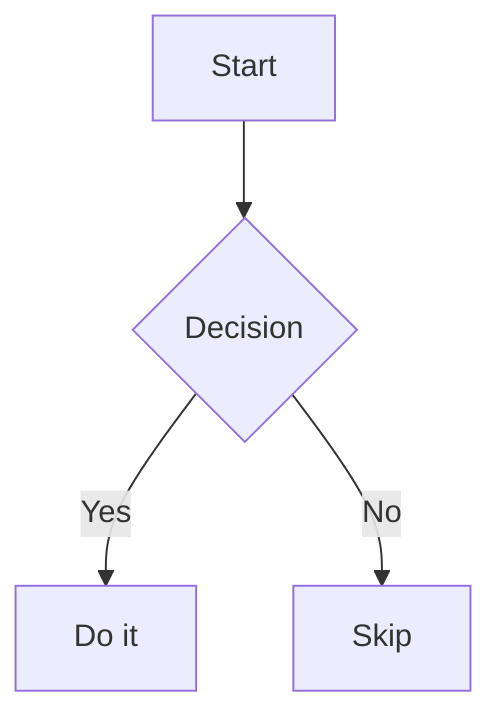

# Office File Preview

Read-only preview for office documents, PDFs, diagrams, and markup files directly inside VS Code.

## Supported Formats

| Format | Extensions | Renderer |
|--------|-----------|----------|
| Word | `.docx` | [docx-preview](https://github.com/VolodymyrBaydalka/docxjs) — text, headings, tables, lists, styles |
| Excel | `.xlsx`, `.xlsm` | [SheetJS](https://sheetjs.com/) — all sheets with tab switcher |
| PDF | `.pdf` | [pdf.js](https://mozilla.github.io/pdf.js/) — all pages, high-resolution canvas |
| PowerPoint | `.pptx` | [pptx-preview](https://github.com/meshesha/pptx-preview) — slides in list view |
| Mermaid | `.mmd`, `.mermaid` | [Mermaid](https://mermaid.js.org/) — flowcharts, sequence diagrams, Gantt, etc. |
| HTML | `.html`, `.htm` | Sandboxed iframe preview |
| Markdown | `.md`, `.markdown` | Rendered markdown with embedded Mermaid diagrams |

All previews are **read-only**. Files are never modified.

## Usage

Opening a `.docx`, `.xlsx`, `.pdf`, `.pptx`, `.mmd`, or `.mermaid` file automatically shows the preview.

For `.html`, `.htm`, `.md`, and `.markdown` files (which have built-in VS Code editors), right-click the file → **Reopen Editor With…** → **Office File Preview (...)** to switch to the preview.

## Mermaid in Markdown

Mermaid code blocks inside `.md` files are automatically rendered as diagrams. The theme follows VS Code's dark/light mode.

````markdown

````

## Known Limitations

- pptx rendering faithfulness depends on slide complexity (animations and SmartArt may not render correctly)
- Large PDFs (200+ pages) render all pages at once; initial load may take a moment
- HTML preview uses a sandboxed iframe; resources with absolute external URLs may not load
